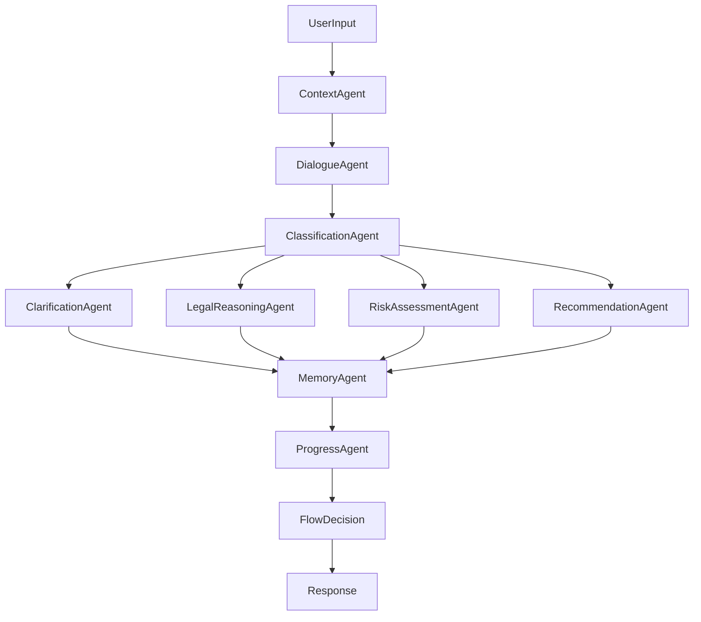

# LegalLink AI - Agentic Conversation System

## Overview

The LegalLink AI implements an advanced **Agentic Conversation System** following the technical architecture specified in the interactive AI technical implementation documents. This system uses **LangGraph** for orchestrating multiple specialized AI agents that work together to provide comprehensive legal assistance.

## Architecture

### 1. Session Management Layer
- **WebSocket + Redis/MongoDB + JWT Auth**
- Persistent conversation state management
- Multi-session support with memory persistence
- Real-time connection management

### 2. Enhanced Input Processing Pipeline
- Input validation and sanitization
- Intent classification and context loading
- Multi-format input support (text, documents)
- Preliminary intent detection

### 3. Agentic Conversation System (LangGraph)
The core of our AI system consists of specialized agents:

#### Core Agents:
- **DialogueAgent**: Manages conversation flow and dialogue state
- **ClassificationAgent**: Classifies legal queries and extracts entities
- **ClarificationAgent**: Handles clarification requests and missing information
- **LegalReasoningAgent**: Provides legal reasoning and guidance
- **RiskAssessmentAgent**: Assesses legal risks and urgency
- **RecommendationAgent**: Provides advocate recommendations and next steps
- **ContextAgent**: Manages conversation context and memory
- **ProgressAgent**: Tracks conversation progress and goals
- **MemoryAgent**: Manages long-term and short-term memory

#### Agent Flow:


### 4. Response Assembly Engine
- Multi-format response generation
- Interactive elements integration
- Advocate service integration
- Legal research integration

### 5. Interaction Management
- Feedback collection and learning
- Analytics and performance monitoring
- Accessibility support

## Key Features

### 🔐 Session Management
- Auto-generated user sessions for public access
- Persistent conversation memory
- Multi-device session continuity
- WebSocket real-time communication

### 🧠 Intelligent Processing
- Multi-agent conversation orchestration
- Context-aware legal guidance
- Entity extraction and classification
- Urgency-based prioritization

### ⚖️ Legal Intelligence
- Domain-specific legal reasoning
- Risk assessment and recommendations
- Relevant law identification
- Case law research integration

### 🤝 Advocate Integration
- Intelligent advocate matching
- Real-time availability checking
- Consultation booking
- Preference-based recommendations

### 📊 Analytics & Learning
- Conversation analytics
- User journey tracking
- Feedback-based improvement
- Performance monitoring

## API Endpoints

### WebSocket Endpoints
```
ws://localhost:8000/ws/chat/{user_id}
```
Real-time chat communication with agentic processing

### HTTP API Endpoints

#### Agentic Chat
```http
POST /api/v1/chat/agentic
```
Process messages through the agentic system

#### Session Management
```http
GET /api/v1/chat/session/{session_id}
```
Get session information and progress

#### Feedback
```http
POST /api/v1/chat/feedback
```
Submit user feedback for learning

#### Advocate Services
```http
POST /api/v1/advocates/search
GET /api/v1/advocates/{advocate_id}
POST /api/v1/appointments/book
```

#### Legal Research
```http
POST /api/v1/legal/search
GET /api/v1/legal/case/{case_id}
```

## Configuration

### Environment Variables

```env
# Server Configuration
SERVER_HOST=0.0.0.0
SERVER_PORT=8000
DEBUG=true

# Session Management
REDIS_URL=redis://localhost:6379
MONGODB_URL=mongodb://localhost:27017
MONGO_DB_NAME=legallink
SESSION_TIMEOUT=3600

# JWT Authentication
JWT_SECRET_KEY=your-secret-key-change-in-production
ACCESS_TOKEN_EXPIRE_MINUTES=30

# External Services
EXPRESS_BACKEND_URL=http://localhost:3000
EXPRESS_API_PREFIX=/api
INDIAN_KANOON_BASE_URL=http://localhost:8001
INDIAN_KANOON_API_KEY=your-api-key

# CORS
CORS_ORIGINS=http://localhost:3000,http://localhost:3001
```

## Installation

### 1. Install Dependencies
```bash
pip install -r requirements.txt
```

### 2. Set Up Environment
```bash
cp .env.example .env
# Edit .env with your configuration
```

### 3. Start Services
```bash
# Start Redis (required for session management)
redis-server

# Start MongoDB (required for persistence)
mongod

# Start the AI service
python main.py
```

### 4. Alternative: Use Docker
```bash
docker-compose up -d
```

## Usage Examples

### WebSocket Chat
```javascript
const ws = new WebSocket('ws://localhost:8000/ws/chat/user123');

ws.onopen = () => {
    // Send message
    ws.send(JSON.stringify({
        message: "I need help with a property dispute",
        type: "user"
    }));
};

ws.onmessage = (event) => {
    const response = JSON.parse(event.data);
    console.log('AI Response:', response.content);
    console.log('Quick Actions:', response.quick_actions);
    console.log('Advocates:', response.advocate_recommendations);
};
```

### HTTP API
```python
import httpx

async with httpx.AsyncClient() as client:
    response = await client.post(
        "http://localhost:8000/api/v1/chat/agentic",
        json={
            "message": "I need legal advice about tenant rights",
            "userId": "user123"
        }
    )
    result = response.json()
    print(f"AI Response: {result['response']}")
```

## Agent System Details

### Conversation Flow States
1. **GREETING**: Initial user interaction
2. **INFORMATION_GATHERING**: Collecting user details and case information
3. **LEGAL_GUIDANCE**: Providing legal analysis and advice
4. **ADVOCATE_RECOMMENDATION**: Matching and recommending advocates
5. **APPOINTMENT_BOOKING**: Facilitating consultation booking
6. **FOLLOW_UP**: Ongoing support and follow-up
7. **CLOSURE**: Conversation completion and feedback

### Memory Management
- **Short-term Memory**: Recent conversation context (last 5 messages)
- **Long-term Memory**: User profile, case history, preferences
- **Session Memory**: Current conversation state and progress
- **Persistent Memory**: Redis/MongoDB storage for continuity

### Legal Domain Classification
- **PROPERTY**: Real estate, tenant rights, property disputes
- **FAMILY**: Divorce, custody, domestic violence
- **CONSUMER**: Product defects, service complaints, refunds
- **CRIMINAL**: Theft, assault, bail, arrests
- **CIVIL**: Contracts, torts, civil disputes
- **CORPORATE**: Business law, contracts, compliance
- **CYBER**: Cybercrime, data protection, online fraud
- **TAXATION**: Tax disputes, compliance, planning
- **LABOR**: Employment law, workplace disputes

### Urgency Levels
- **LOW**: General inquiries, non-time-sensitive matters
- **MEDIUM**: Moderate urgency, within days
- **HIGH**: Urgent matters, within 24-48 hours
- **CRITICAL**: Emergency situations, immediate attention needed

## Monitoring & Analytics

### Health Endpoints
```http
GET /health
GET /api/v1/health/express
GET /api/v1/health/indian-kanoon
```

### Metrics
- Conversation completion rates
- User satisfaction scores
- Response accuracy metrics
- Agent performance analytics
- Session duration and engagement

## Development

### Adding New Agents
1. Create agent class inheriting from `BaseAgent`
2. Implement `process(state: AgentState)` method
3. Add to agent graph in `agent_graph.py`
4. Update orchestrator to include new agent

### Extending Legal Knowledge
1. Update legal knowledge base in `LegalReasoningAgent`
2. Add new domain mappings in `ClassificationAgent`
3. Extend entity extraction patterns
4. Update response templates

### Testing
```bash
# Run unit tests
python -m pytest tests/

# Test WebSocket connection
python test_websocket.py

# Test API endpoints
python -m pytest tests/test_api.py
```

## Deployment

### Production Configuration
- Use production-grade Redis cluster
- MongoDB replica set for high availability
- Load balancing for WebSocket connections
- SSL/TLS encryption
- Rate limiting and authentication
- Monitoring and logging

### Scaling
- Horizontal scaling with multiple instances
- Redis Cluster for session distribution
- MongoDB sharding for large datasets
- CDN for static content
- Microservices architecture

## Contributing

1. Fork the repository
2. Create feature branch
3. Implement following the agent pattern
4. Add comprehensive tests
5. Update documentation
6. Submit pull request

## License

MIT License - see LICENSE file for details
